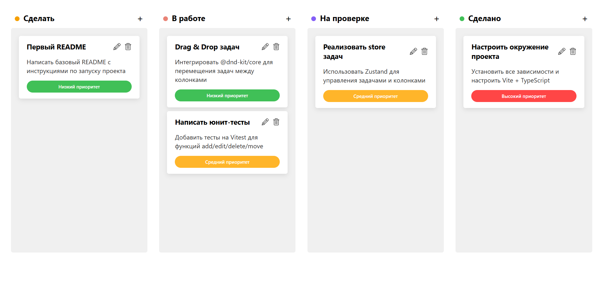

# Kanban Board

📌 Kanban Board — интерактивная канбан-доска на React с поддержкой drag & drop, добавлением, редактированием, удалением задач и сохранением данных в localStorage.

---

## 🚀 Демо
[Kanban Board на GitHub Pages](https://mykhailoko.github.io/kanban-board)



---

## 📌 Функционал
- Создание, редактирование и удаление задач  
- Перетаскивание задач между колонками   
- Сохранение задач в localStorage  
- Drag & Drop интерфейс на @dnd-kit/core 

---

## 🛠 Технологии
- React + TypeScript  
- Zustand (state management)  
- @dnd-kit/core (drag & drop)  
- Vite (сборка)  
- Vitest (юнит-тесты)

---

## 💻 Запуск проекта
```bash
git clone https://github.com/mykhailoko/kanban-board.git
cd kanban-board
npm install
npm run dev
```

---
## 🧪 Тесты
Юнит-тесты store (Zustand):
```bash
npm test
```
